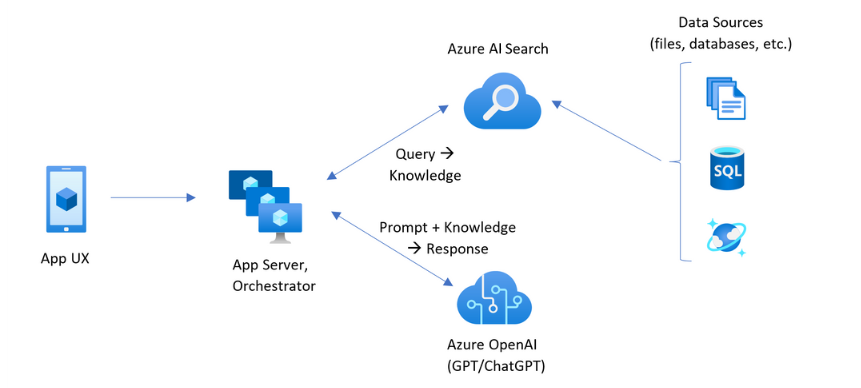
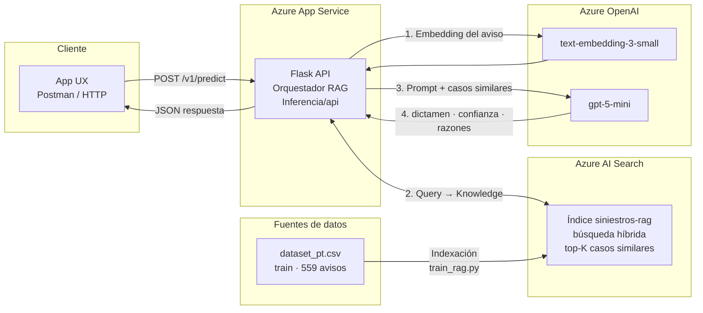
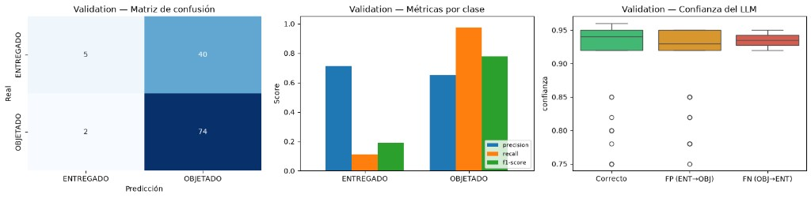
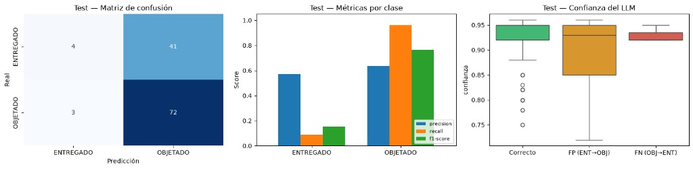
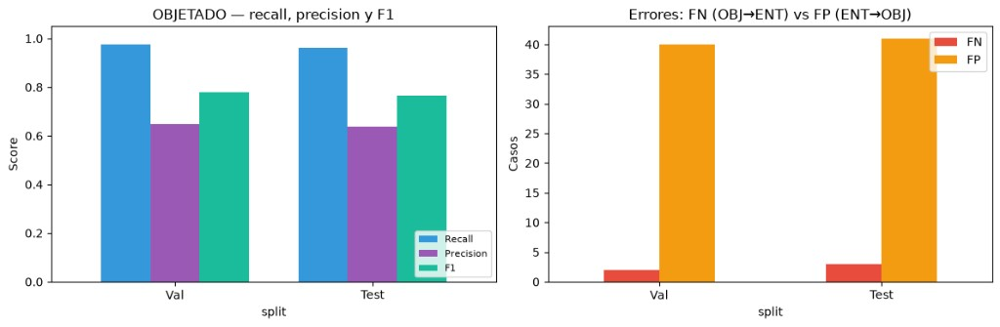
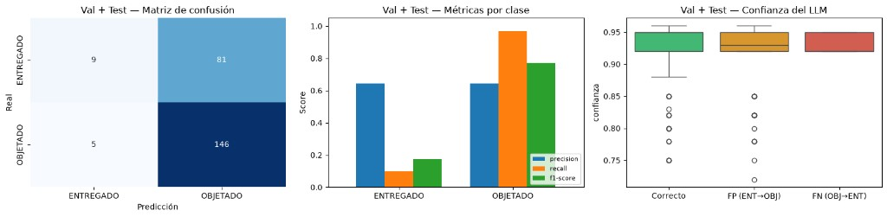

# Prueba Técnica — Clasificador RAG de Siniestros Vehiculares

**Subocol IA — Analytics Jr**  
**Juan Noguera**  
**Julio de 2026**

**Repositorio:** [JuanNogRa/Proyect-clasificador](https://github.com/JuanNogRa/Proyect-clasificador)  
**API en producción:** `https://rag-siniestros-api-fpgsfaepfsd6abc7.westus3-01.azurewebsites.net`

---

## Resumen

En este documento se describe el proceso de desarrollo de la aplicación de clasificación automática de siniestros vehiculares con dictamen binario (`ENTREGADO` / `OBJETADO`). Se explica la arquitectura implementada basada en **RAG (Retrieval-Augmented Generation)** sobre **Azure OpenAI** y **Azure AI Search**, así como el pipeline de entrenamiento que comprende la extracción y agregación del dataset, la indexación vectorial del corpus histórico, la configuración del prompt de clasificación y la evaluación sobre conjuntos de validación y prueba independientes. También se presenta la API de inferencia desplegada en **Azure App Service** con CI/CD mediante GitHub Actions.

Los resultados sobre la clase **OBJETADO** (métrica principal de negocio) se resumen así:

| Conjunto | Casos | Recall | Precision | F1 | FN |
|----------|------:|-------:|----------:|---:|---:|
| Validación | 121 | 0,974 | 0,649 | 0,779 | 2 |
| Prueba | 120 | 0,960 | 0,637 | 0,766 | 3 |
| **Val + Test** | **241** | **0,97** | **0,64** | **0,77** | **5** |

El modelo prioriza la detección de objeciones (alto recall) a costa de mayor conservadurismo (más falsos positivos), alineado con el criterio de negocio.

---

## 1. Introducción

En las siguientes secciones se explica el pipeline para el desarrollo de un clasificador de dictámenes de siniestros vehiculares.

El pipeline empieza en la extracción y consolidación del dataset de avisos (`dataset_pt.csv`), donde cada registro a nivel pieza se agrega en un aviso único con vehículo, versión de hechos, piezas afectadas y dictamen histórico. Este proceso se describe en la [sección 2.1](#21-dataset-de-avisos-de-siniestro).

Se explica la arquitectura del modelo a través de un diagrama de bloques. Se define la tarea como **clasificación binaria asistida por recuperación**: dado un aviso nuevo, el sistema busca casos históricos similares en un índice vectorial y un LLM razona sobre el relato, las piezas y los precedentes para emitir dictamen, confianza y razones. El proceso y el diagrama se presentan en la [sección 2.2](#22-arquitectura-del-modelo-rag).

En la [sección 3](#3-aplicación-de-inferencia-usando-el-modelo-entrenado) se presenta el funcionamiento de la API Flask para aplicar el modelo indexado sobre avisos en tiempo real, tanto en entorno local como en Azure App Service.

Por último, en la [sección 4](#4-análisis-de-resultados) se discuten los resultados obtenidos del modelo evaluado, y en la [sección 5](#5-instrucciones-para-replicar-el-entorno-y-levantar-el-servicio) se detallan las instrucciones paso a paso para replicar el entorno y levantar el servicio.

---

## 2. Proceso de entrenamiento del modelo RAG

En primer lugar se generó el dataset consolidado a partir del archivo de prueba técnica, agregando múltiples filas de piezas por aviso en un único registro con texto unificado. El corpus de entrenamiento (70 % de los avisos) se indexó en **Azure AI Search** con embeddings de **text-embedding-3-small**. La clasificación se realiza con **gpt-5-mini** mediante un prompt estructurado con reglas de negocio explícitas. El código del pipeline se organizó en módulos reutilizables (`Entrenamiento/src/`) y un notebook principal (`pt.ipynb`) para exploración y evaluación.

### 2.1. Dataset de avisos de siniestro

El dataset original contiene **7.532 registros a nivel pieza**, que tras la agregación por `numero_aviso` resultan en **800 avisos únicos** con distribución:

| Clase | Cantidad | Proporción |
|-------|----------|------------|
| OBJETADO | 500 | 62,5 % |
| ENTREGADO | 300 | 37,5 % |

El particionamiento es **estratificado** por `estado_aviso` (`random_state=42`):

| Conjunto | Avisos | Uso |
|----------|--------|-----|
| Train | 559 (70 %) | Indexación en Azure AI Search |
| Val | 121 (15 %) | Ajuste de prompt y top-K |
| Test | 120 (15 %) | Evaluación final (no indexado) |

El dataset se separó en train, val y test con la proporción habitual **70 % / 15 % / 15 %**, estratificada por clase. Es la partición típica en aprendizaje automático: train para entrenar o ajustar el modelo, val para comparar configuraciones y test para la evaluación final sin filtración. En una primera exploración se siguió ese esquema pensando en un modelo ML clásico; al adoptar RAG se conservó la misma división: **solo train** alimenta el índice vectorial, mientras **val y test** quedan fuera del corpus indexado para medir el desempeño de forma honesta.

Para cada aviso se construye un texto estructurado con vehículo, versión de hechos, piezas afectadas y conteos. En el corpus indexado (train) se incluye además el dictamen histórico; en inferencia ese campo se omite para evitar filtración de información.

**Preprocesamiento principal** (`agregar_por_aviso` en `data_pipeline.py`):

- Agrupación por `numero_aviso`
- Consolidación de piezas en lista y cadena (`piezas_texto`)
- Construcción del campo `vehiculo` = tipo + marca + línea + modelo
- Split estratificado train / val / test

### 2.2. Arquitectura del modelo RAG

La arquitectura sigue el patrón **RAG sobre Azure**: un orquestador (API Flask) coordina la recuperación de casos similares en **Azure AI Search** y la generación del dictamen en **Azure OpenAI**, alimentado por el corpus histórico indexado en el entrenamiento.



*Figura adaptada del patrón RAG en Azure (App UX → Orquestador ↔ AI Search ↔ OpenAI). Fuente: [Administración de requisitos — Microsoft Learn](https://learn.microsoft.com/es-es/industry/mobility/architecture/manage-requirements).*

**Adaptación a este proyecto:**



| Flujo | Descripción |
|-------|-------------|
| **1. Embedding** | El aviso se vectoriza con `text-embedding-3-small`. |
| **2. Retrieval** | Azure AI Search devuelve los `top-K` casos históricos más similares (híbrido texto + vector). |
| **3. Generación** | `gpt-5-mini` recibe el system prompt, los casos recuperados y el aviso nuevo. |
| **4. Respuesta** | La API devuelve JSON con `dictamen`, `confianza`, `razones` y `casos_similares`. |

**Componentes:**

| Componente | Tecnología | Función |
|------------|------------|---------|
| Embeddings | `text-embedding-3-small` (1536 dims) | Vectorizar texto del aviso |
| Índice | Azure AI Search (`siniestros-rag`) | Almacenar corpus train + búsqueda híbrida |
| Clasificador | `gpt-5-mini` | Razonar sobre caso nuevo + precedentes |
| API | Flask + Gunicorn | Servir inferencia HTTP |
| Deploy | Azure App Service + GitHub Actions | Producción con CI/CD |

**Criterios del system prompt** (`rag_classifier.py`):

1. Inconsistencia relato ↔ piezas → OBJETADO
2. Tercero responsable sin cobertura clara → OBJETADO
3. Caso histórico similar OBJETADO con mismo patrón → OBJETADO
4. Confianza &lt; 0,9 con señales de objeción → OBJETADO
5. ENTREGADO solo si relato coherente, mayoría de similares ENTREGADO y sin exclusiones

**Prioridad de negocio:** alto **recall en OBJETADO** (minimizar falsos negativos / pagos indebidos).

**Hiperparámetros finales:**

| Parámetro | Valor |
|-----------|-------|
| `RAG_TOP_K` | 8 |
| Embedding dimensions | 1536 |
| Response format | `json_object` |
| Estrategia ante duda | OBJETADO (conservador) |

Se optó por **RAG desde el diseño** (antes que un enfoque ML clásico) porque funciona mejor para capturar reglas de negocio complejas, razonar sobre coherencia semántica entre relato y piezas, y ofrecer explicabilidad mediante casos similares y razones textuales.

---

## 3. Aplicación de inferencia usando el modelo entrenado

Para el desarrollo de la aplicación se cargaron los módulos RAG de `Entrenamiento/src/` desde la API Flask (`Inferencia/api/`) mediante `bootstrap.py`, evitando duplicar código entre entrenamiento e inferencia.

**Prerrequisito:** el índice `siniestros-rag` debe existir en Azure AI Search (generado con `python scripts/train_rag.py`).

### 3.1. Endpoints

| Método | Ruta | Descripción |
|--------|------|-------------|
| `GET` | `/health` | Verificación de disponibilidad |
| `POST` | `/v1/predict` | Clasificación de un aviso |

### 3.2. Flujo de inferencia

1. El cliente envía JSON con datos del aviso.
2. La API construye el texto del caso (`build_case_text`).
3. Se genera el embedding y se recuperan los `top_k` casos similares en Azure AI Search.
4. El LLM recibe el system prompt, los casos históricos y el caso nuevo.
5. Se devuelve JSON con `dictamen`, `confianza`, `razones` y `casos_similares`.

**Ejemplo de request:**

```json
{
  "numero_aviso": "281375",
  "vehiculo": "camioneta JEEP COMPASS SPORT 2019",
  "version_hechos": "Colisión en parqueadero por reversa de tercero...",
  "piezas_texto": "broche carroceria, farol tapabarros derecho",
  "piezas_totales": 2,
  "piezas_cambio": 2
}
```

**Ejemplo de response:**

```json
{
  "numero_aviso": "281375",
  "dictamen": "OBJETADO",
  "confianza": 0.92,
  "razones": ["Inconsistencia entre relato y piezas", "Caso histórico similar OBJETADO"],
  "casos_similares": ["175898", "205847", "216383"]
}
```

### 3.3. Despliegue en Azure

La API se despliega en **Azure App Service** (Linux, Python 3.11) con Gunicorn:

```
gunicorn --bind=0.0.0.0:8000 --timeout 120 --access-logfile - --error-logfile - wsgi:app
```

El CI/CD se ejecuta con GitHub Actions (`.github/workflows/main_rag-siniestros-api.yml`) en cada push a `main`. La autenticación hacia Azure OpenAI puede realizarse con **Managed Identity** (sin API key) o con clave en variables de entorno. Ver [MANAGED-IDENTITY-AZURE.md](MANAGED-IDENTITY-AZURE.md) y [DEPLOY-AZURE.md](DEPLOY-AZURE.md).

---

## 4. Análisis de resultados

Con la evaluación del modelo sobre los conjuntos val y test se obtienen las siguientes métricas. La métrica principal de negocio es el **recall de OBJETADO**, dado que un falso negativo implica clasificar como ENTREGADO un caso que debía ser OBJETADO.

Las gráficas se generan en `Entrenamiento/pt.ipynb` (matriz de confusión, métricas por clase, confianza del LLM y comparación val vs test).

### 4.1. Validation (121 casos)

| Métrica | ENTREGADO | OBJETADO |
|---------|-----------|----------|
| Precision | 0,71 | 0,65 |
| Recall | 0,11 | **0,97** |
| F1 | 0,19 | **0,78** |

**Matriz de confusión** (filas = real, columnas = predicción):

|  | Pred ENTREGADO | Pred OBJETADO |
|--|----------------|---------------|
| Real ENTREGADO | 5 | 40 |
| Real OBJETADO | **2** | 74 |



*Figura 1. Evaluación en validación (121 avisos).*

### 4.2. Test (120 casos)

| Métrica | ENTREGADO | OBJETADO |
|---------|-----------|----------|
| Precision | 0,57 | 0,64 |
| Recall | 0,09 | **0,96** |
| F1 | 0,15 | **0,77** |

**Matriz de confusión:**

|  | Pred ENTREGADO | Pred OBJETADO |
|--|----------------|---------------|
| Real ENTREGADO | 4 | 41 |
| Real OBJETADO | **3** | 72 |



*Figura 2. Evaluación en prueba (120 avisos).*

### 4.3. Comparación val vs test

| Split | Casos | Recall OBJ | Precision OBJ | F1 OBJ | FN | FP |
|-------|------:|-----------:|--------------:|-------:|---:|---:|
| Val | 121 | 0,974 | 0,649 | 0,779 | 2 | 40 |
| Test | 120 | 0,960 | 0,637 | 0,766 | 3 | 41 |
| **Val + Test** | **241** | **0,97** | **0,64** | **0,77** | **5** | **81** |



*Figura 3. Contraste de métricas OBJETADO y errores entre splits.*

### 4.4. Val + Test combinado (241 casos)

| Métrica | ENTREGADO | OBJETADO |
|---------|-----------|----------|
| Precision | 0,64 | 0,64 |
| Recall | 0,10 | **0,97** |
| F1 | 0,18 | **0,77** |

**Matriz de confusión:**

|  | Pred ENTREGADO | Pred OBJETADO |
|--|----------------|---------------|
| Real ENTREGADO | 9 | 81 |
| Real OBJETADO | **5** | 146 |



*Figura 4. Evaluación agregada val + test (241 avisos).*

### 4.5. Confianza del LLM

Además de `dictamen`, el modelo devuelve un campo **`confianza`** (0,0–1,0) en el JSON de respuesta. La gráfica de la derecha en las [Figura 1](#41-validation-121-casos), [Figura 2](#42-test-120-casos) y [Figura 4](#44-val--test-combinado-241-casos) es un **boxplot** que muestra cómo se distribuye esa confianza según el tipo de resultado:

| Categoría | Significado |
|-----------|-------------|
| **Correcto** | Predicción acertada (TP o TN) |
| **FP (ENT→OBJ)** | Falso positivo: era ENTREGADO, predijo OBJETADO |
| **FN (OBJ→ENT)** | Falso negativo: era OBJETADO, predijo ENTREGADO |

**Qué se observa:**

- La mediana de confianza en aciertos ronda **0,94–0,95**.
- En errores (FP y FN) la mediana también es alta (**~0,93–0,95**): el modelo suele estar **seguro incluso cuando se equivoca** (sobreconfianza).
- Algunos aciertos tienen confianza más baja (~0,75–0,85), pero son pocos (outliers).

**Implicación de negocio:** no basta con filtrar por `confianza >= 0,9` para detectar errores, porque muchos FP y FN también reportan confianza alta. La confianza complementa la auditoría, pero el criterio principal sigue siendo el dictamen y las `razones` / `casos_similares`.

### 4.6. Discusión

Sobre el conjunto **[Val + Test (241 avisos)](#44-val--test-combinado-241-casos)**, 151 OBJETADO / 90 ENTREGADO, los resultados indican que el modelo **cumple el objetivo de negocio**:

| Indicador | Val + Test | Interpretación |
|-----------|------------|----------------|
| Recall OBJETADO | **0,97** (146/151) | Detecta casi todas las objeciones reales |
| Falsos negativos (FN) | **5** | Solo 5 OBJETADO pasaron como ENTREGADO — riesgo bajo de pago indebido |
| Precision OBJETADO | **0,64** | De cada 100 predicciones OBJETADO, ~64 son correctas |
| Falsos positivos (FP) | **81** | 81 ENTREGADO marcados como OBJETADO — más cola de revisión manual |
| Recall ENTREGADO | **0,10** (9/90) | Consecuencia de la estrategia conservadora |
| F1 OBJETADO | **0,77** | Balance razonable priorizando detección de objeciones |

El **trade-off** es claro: se sacrifica recall en ENTREGADO y se aceptan **81 FP** a cambio de mantener **FN en 5** sobre 241 casos. En términos de negocio, es preferible enviar casos sanos a revisión manual que dejar pasar objeciones reales.

La **[estabilidad entre val y test](#43-comparación-val-vs-test)** refuerza la conclusión: recall OBJ 0,974 vs 0,960, FN 2 vs 3 y FP 40 vs 41. No hay divergencia fuerte entre splits; el comportamiento agregado es coherente con lo observado por separado.

La **[confianza del LLM](#45-confianza-del-llm)** muestra sobreconfianza: el modelo reporta valores altos (~0,93–0,95) tanto en aciertos como en errores, por lo que `confianza` no sustituye la revisión humana en casos dudosos.

**Trabajo futuro propuesto**

Aunque el recall de OBJETADO cumple el objetivo de negocio, los 5 falsos negativos y los 81 falsos positivos del conjunto val+test muestran margen de mejora. Se propone analizar de forma puntual los 5 FN — avisos objetados que el modelo clasificó como entregados — revisando en cada uno la versión de hechos, las piezas, las razones generadas y los casos similares recuperados, a fin de entender por qué no se aplicó la objeción y, si corresponde, ajustar el prompt o la recuperación en Azure AI Search. Del mismo modo, se recomienda revisar los 81 FP para identificar patrones repetidos: en este modelo suelen deberse a la estrategia conservadora del prompt, a la activación de reglas como tercero o inconsistencia relato–piezas, o a que al menos 1 caso similar objetado aparece entre los recuperados. Esos casos están registrados en `data/val_predictions.csv` y `data/test_predictions.csv`.

Las reglas de negocio: terceras personas involucradas, inconsistencia, duda razonable y prioridad de recall en OBJETADO ya están definidas en el system prompt. No obstante, el campo de confianza que devuelve el LLM no distingue con claridad entre aciertos y errores, tal como se muestra en la [sección 4.5](#45-confianza-del-llm). Se propone, en una fase posterior, complementar ese indicador con otras señales: las probabilidades internas del propio modelo (logprobs), las puntuaciones de recuperación y la proporción de dictámenes entre los casos similares, obtenibles sin modificar el LLM; y evaluaciones por lote sobre val y test, útiles para auditar el servicio fuera de la inferencia en tiempo real.

Por último, se propone evaluar otros despliegues de lenguaje y de embeddings que reduzcan costo en Azure sin degradar el recall; automatizar la re-indexación del corpus train cuando se incorporen avisos nuevos (`train_rag.py`); completar la operación en producción con Managed Identity en Search y Application Insights; y monitorear de forma continua recall, tasa de FP y deriva del servicio para decidir cuándo re-indexar o retocar el prompt.

---

## 5. Instrucciones para replicar el entorno y levantar el servicio

### 5.1. Requisitos previos

- Python 3.11+ y Conda (Miniconda/Anaconda)
- Git
- Cuenta Azure con Azure OpenAI / AI Foundry y Azure AI Search
- Recursos desplegados: deployments `gpt-5-mini` y `text-embedding-3-small`

### 5.2. Clonar e instalar dependencias

```bash
git clone https://github.com/JuanNogRa/Proyect-clasificador.git
cd Proyect-clasificador
conda activate base
pip install -r Entrenamiento/requirements.txt
pip install -r Inferencia/requirements.txt
```

### 5.3. Configurar credenciales

```bash
cd Entrenamiento
copy .env.example .env
```

Completar `Entrenamiento/.env`:

```env
AZURE_OPENAI_ENDPOINT=https://TU-RECURSO.services.ai.azure.com/openai/v1
AZURE_OPENAI_CHAT_DEPLOYMENT=gpt-5-mini
AZURE_OPENAI_EMBEDDING_DEPLOYMENT=text-embedding-3-small
AZURE_SEARCH_ENDPOINT=https://TU-RECURSO.search.windows.net
AZURE_SEARCH_INDEX_NAME=siniestros-rag
AZURE_SEARCH_API_KEY=TU-KEY
RAG_TOP_K=8
```

Autenticación local sin API key: `az login` y dejar `AZURE_OPENAI_API_KEY` vacío.

### 5.4. Indexar corpus de entrenamiento

```bash
cd Entrenamiento
python scripts/train_rag.py
```

Salida esperada: `Indexados: 559 documentos de train`.

### 5.5. Evaluar (opcional)

Abrir `Entrenamiento/pt.ipynb` con directorio de trabajo en `Entrenamiento/`. Las predicciones se exportan en `data/val_predictions.csv` y `data/test_predictions.csv`.

### 5.6. Levantar API local

```bash
cd Inferencia
scripts\install_deps.bat   # primera vez
scripts\run_api.bat
```

Verificar:

```bash
curl http://localhost:8000/health
curl -X POST http://localhost:8000/v1/predict -H "Content-Type: application/json" -d "{\"numero_aviso\":\"281375\",\"vehiculo\":\"camioneta JEEP COMPASS SPORT 2019\",\"version_hechos\":\"colision en parqueadero\",\"piezas_texto\":\"broche carroceria, farol tapabarros derecho\",\"piezas_totales\":2,\"piezas_cambio\":2}"
```

### 5.7. Desplegar en Azure

1. Crear App Service Linux Python 3.11 (ver [DEPLOY-AZURE.md](DEPLOY-AZURE.md)).
2. Configurar variables de entorno (endpoint con `https://`, deployments, Search).
3. Startup command: Gunicorn sobre `wsgi:app`.
4. Activar Managed Identity si aplica (ver [MANAGED-IDENTITY-AZURE.md](MANAGED-IDENTITY-AZURE.md)).
5. Conectar GitHub Actions → `git push origin main`.
6. Verificar: `curl https://rag-siniestros-api-TU-SUFFIX.azurewebsites.net/health`.

### 5.8. Checklist

| Paso | Verificación |
|------|--------------|
| `.env` configurado | Endpoints y keys Azure |
| `train_rag.py` ejecutado | 559 documentos indexados |
| `GET /health` | HTTP 200 |
| `POST /v1/predict` | JSON con dictamen |
| Deploy Azure | Log stream sin errores |

---

## Referencias

[1] L. Lewis et al., "Retrieval-Augmented Generation for Knowledge-Intensive NLP Tasks," *NeurIPS*, 2020.

[2] Microsoft, "Azure OpenAI Service documentation," [Online]. Available: https://learn.microsoft.com/azure/ai-services/openai/

[3] Microsoft, "Vector search in Azure AI Search," [Online]. Available: https://learn.microsoft.com/azure/search/vector-search-overview

[4] Microsoft, "Diagrama de arquitectura de patrones RAG con búsqueda de Azure AI," *Administración de requisitos*, [Online]. Available: https://learn.microsoft.com/es-es/industry/mobility/architecture/manage-requirements

[5] Microsoft, "Diseño y desarrollo de una solución RAG en Azure," *Azure Architecture Center*, [Online]. Available: https://learn.microsoft.com/es-es/azure/architecture/ai-ml/guide/rag/rag-solution-design-and-evaluation-guide

---

*Documento técnico del proyecto RAG Siniestros — Subocol IA. Estructura basada en `Documentación_pruebaTecnica.pdf`.*
